<h1 align="center">
  <b>Machine Learning Models for Eardrum frames classification and Comparison</b><br>
</h1>

## Description:
This is a project implementing six machine learning models and comparing classification performances between two sets of image datasets, which is part of a bigger AI developing research project. The image datasets comes from both AI and human frame selection of clinical otoscope videos (private to the company, not included) on human eardrums, each ideally representing the single most diagnostically informative frame of the few second videos. The purpose of this project is to validate the performance of the frame selection algorithm of the developing AI by comparing classification results of auto-selected frames with results of human-selected frames of same set of videos.

## Requirements: 
- Python >= 3.9
- torch == 2.7.1 + cu118
- torchvision == 0.22.1 +cu118
- torchaudio == 2.7.1 + cu118
- timm = 1.0.15
- torchmetrics == 1.7.4
- numpy
- pandas
- scikit-learn
- matplotlib
- optuna == 2.10.1

## Installation
```
$ git clone git@github.com:sza0816/AI-EarInfection-WFU.git
$ cd still_images
$ pip install -r requirements.txt       # --no-user if in virtual env
```

## Usage
```
$ conda activate <env>
$ cd still_images                 # if needed
```
To run specific model on specific dataset: 
```
$ sbatch job.slurm <model_name> <keyframe_mode>
# ex: sbatch job.slurm convnext auto (run convnext model on the auto_selected frame datasets)
```
To run all models on all datasets: 
```
$ bash submit_jobs.sh
# adjust variable 'DELAY' for a longer period between each job
```
To check job status:
```
$ squeue -u <username>
```
To tune hyperparameters for specific model by running `job_tune_parameter.slurm`:
```
# adjust <model_name> and 'root directory' in file 'parameter_search_only_best_left'.py
sbatch job_tune_parameter.slurm
```

## Output Structure
After training, the following folder will be generated for each model and either keyframe mode:
```
output_<model_name>/
  ├── auto/ or human/ # Keyframe mode
  │ ├── output.log                            # Logs all epochs and prints final evaluation metrics
  │ ├── ROC_EachClass_<model_name>.png        # ROC curves per class
  │ ├── ROC_MacroAvg_<model_name>.png         # Macro-average OC
  │ ├── ROC_MicroAvg_<model_name>.png         # Micro-average ROC 
  │ └── T_V_loss_<model_name>.png             # Training vs. validation loss curve 
```
For hyperparameter tuning: 
```
output_param_search/
  └── job_tune_parameter_output.log # Logs all trials and best hyperparameters (up to 200 trials)
```
## Evaluation
| Model           | Auto Selected Frames                                                                 | Human Selected Frames                                                                | 
|-----------------|---------------------------------------------------------------------------------------|---------------------------------------------------------------------------------------| 
| ResNet34        | 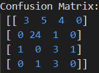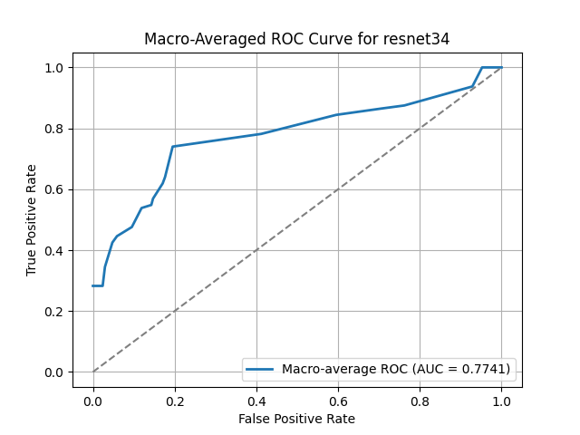 | 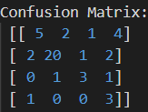 | 
| ViT-Base-16     |   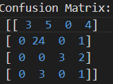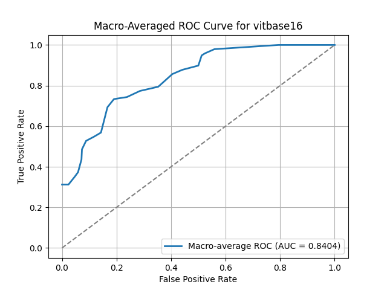   |   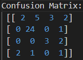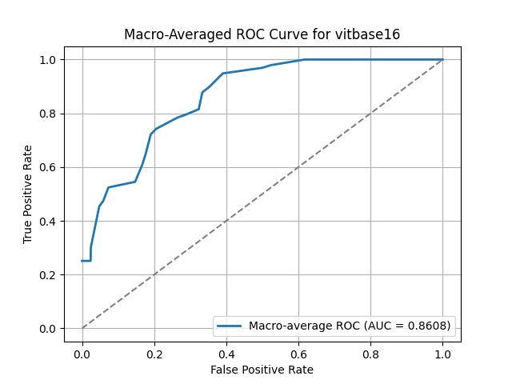   | 
| EfficientNetB0  | 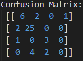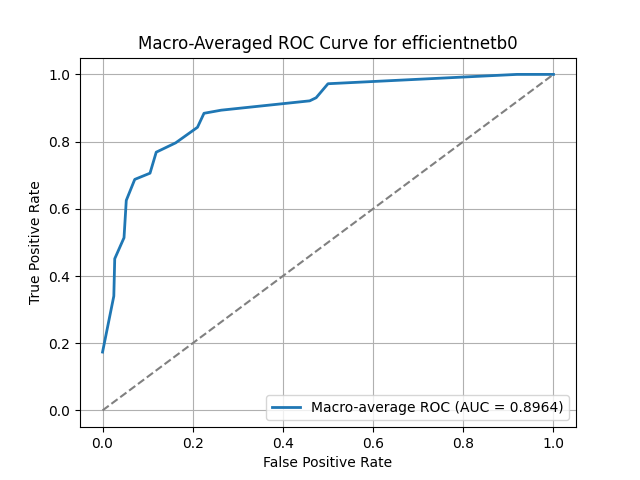 | 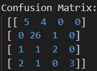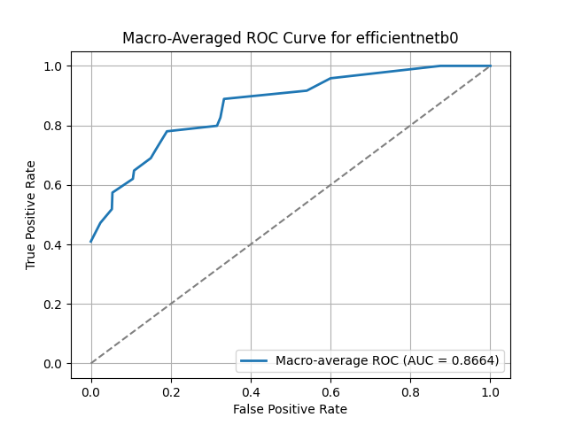 | 
| EfficientViT-B0 | 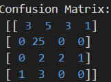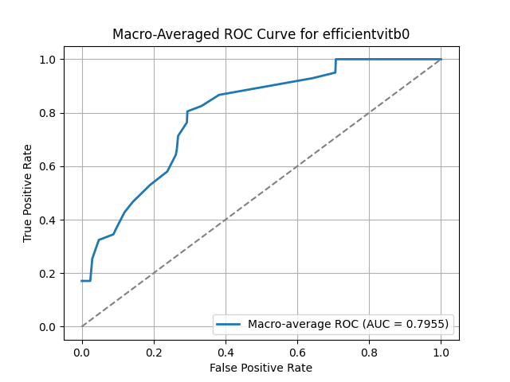 | 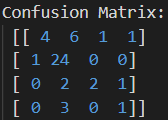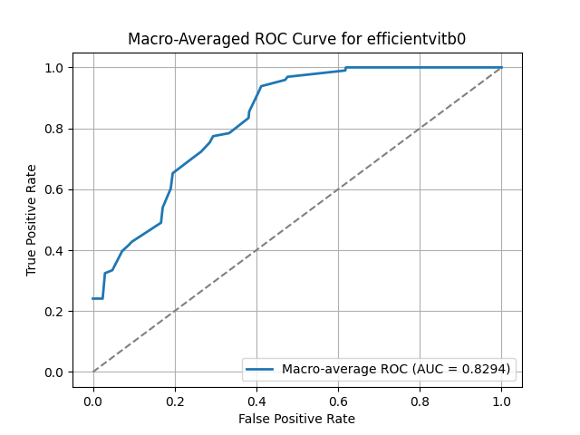 | 
| Swin-T          | 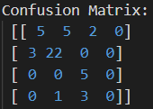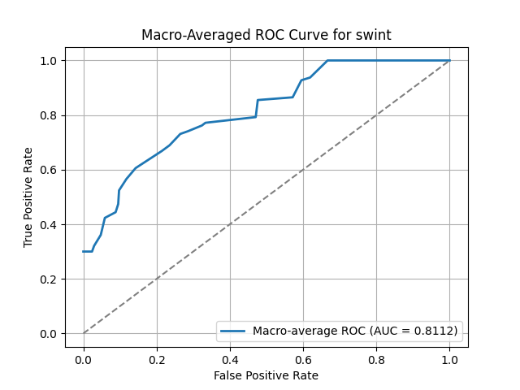 | 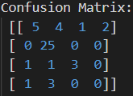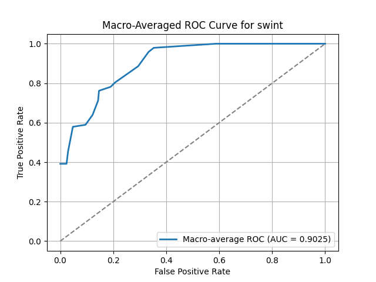 | 
| ConvNeXt        | 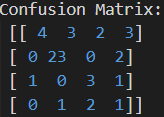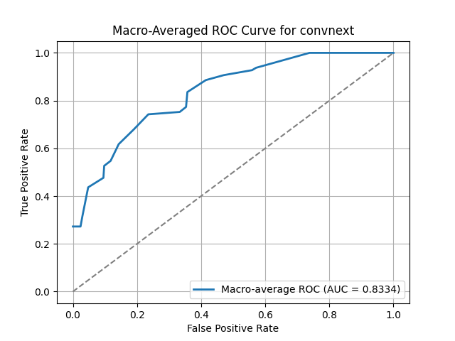 | 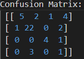 | 

| ACC                    | AUC                       |
|------------------------|---------------------------|
| 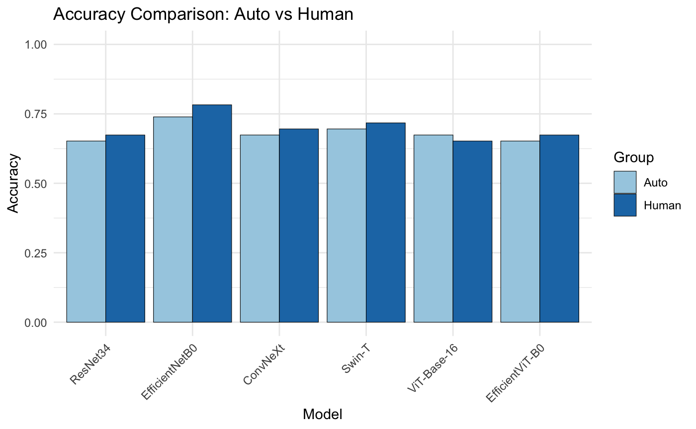 | 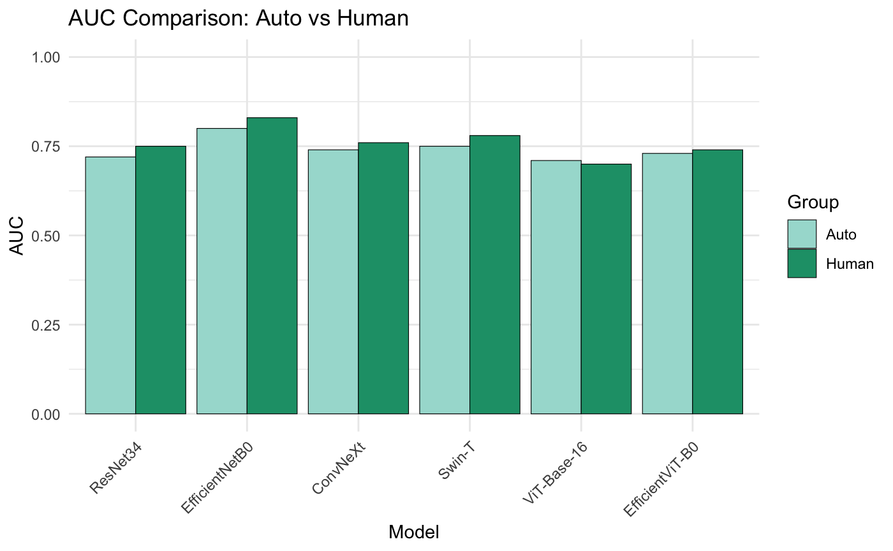 |