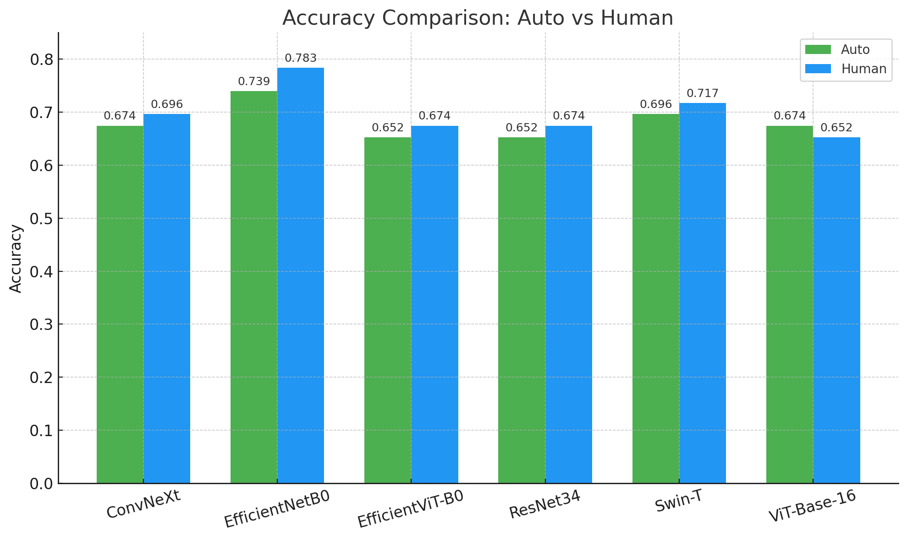
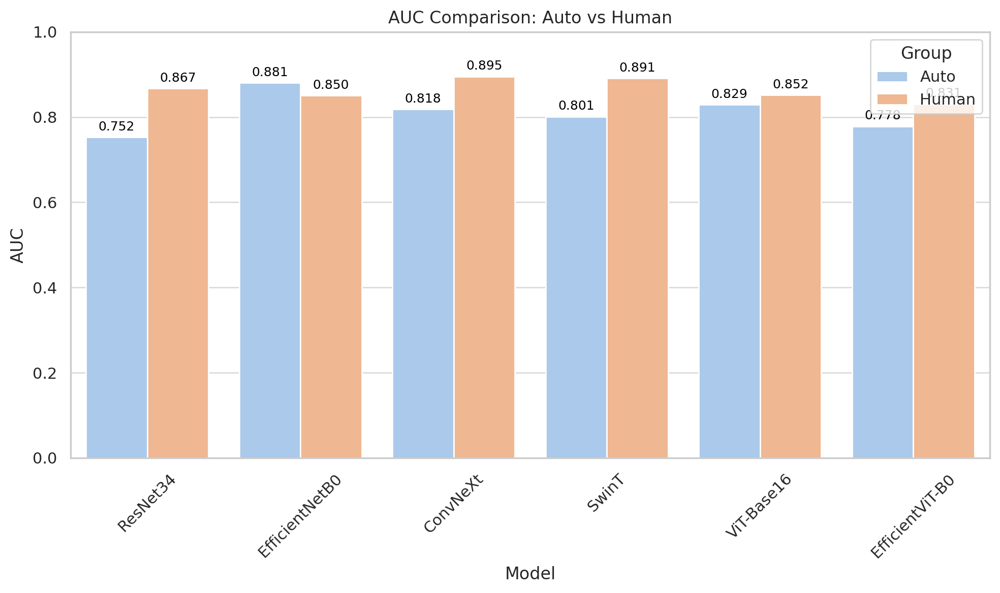

<h1 align="center">
  <b>Machine Learning Models for Eardrum frames classification and Comparison</b><br>
</h1>

## Description:
This project implements six machine learning models to compare classification performance between two image datasets, as part of a broader AI development initiative. The datasets consist of frames selected from clinical otoscope videos (not included due to privacy constraints), where each image represents the most diagnostically informative frame of a short video. One set is selected automatically by the AI, while the other is manually selected by clinicians. The goal is to evaluate the effectiveness of the AI’s frame selection algorithm by comparing its classification performance against that of human-selected frames on the same set of videos. 

## Requirements: 
- Python >= 3.9
- torch == 2.7.1 + cu118
- torchvision == 0.22.1 +cu118
- torchaudio == 2.7.1 + cu118
- timm = 1.0.15
- torchmetrics == 1.7.4
- numpy
- pandas
- scikit-learn
- matplotlib
- optuna == 2.10.1

## Installation
```
$ git clone git@github.com:sza0816/AI-EarInfection-WFU.git
$ cd still_images
$ pip install -r requirements.txt       # --no-user if in virtual env
```

## Usage
```
$ conda activate <env>
$ cd still_images                 # if needed
```
To run specific model on specific dataset: 
```
$ sbatch job.slurm <model_name> <keyframe_mode>
# ex: sbatch job.slurm convnext auto (run convnext model on the auto_selected frame datasets)
```
To run all models on all datasets: 
```
$ bash submit_jobs.sh
# adjust variable 'DELAY' for a longer period between each job
```
To check job status:
```
$ squeue -u <username>
```
To tune hyperparameters for specific model by running `job_tune_parameter.slurm`:
```
# adjust <model_name> and 'root directory' in file 'parameter_search_only_best_left'.py
sbatch job_tune_parameter.slurm
```

## Output Structure
After training, the following folder will be generated for each model and either keyframe mode:
```
output_<model_name>/
  ├── auto/ or human/ # Keyframe mode
  │ ├── output.log                            # Logs all epochs and prints final evaluation metrics
  │ ├── ROC_EachClass_<model_name>.png        # ROC curves per class
  │ ├── ROC_MacroAvg_<model_name>.png         # Macro-average OC
  │ ├── ROC_MicroAvg_<model_name>.png         # Micro-average ROC 
  │ └── T_V_loss_<model_name>.png             # Training vs. validation loss curve 
```
For hyperparameter tuning: 
```
output_param_search/
  └── job_tune_parameter_output.log # Logs all trials and best hyperparameters (up to 200 trials)
```
## Evaluation
| Model           | Auto Selected Frames                                                                 | Human Selected Frames                                                                | 
|-----------------|---------------------------------------------------------------------------------------|---------------------------------------------------------------------------------------| 
| ResNet34        |  |  | 
| ViT-Base-16     |      |      | 
| EfficientNetB0  |  |  | 
| EfficientViT-B0 |  |  | 
| Swin-T          |  |  | 
| ConvNeXt        |  |  | 

| ACC                    | AUC                       |
|------------------------|---------------------------|
|  |  |

**Note**: Other metrics can be viewed in the model corresponding output files.

**Summary Observation**

As shown in the accuracy and AUC comparison plots above, models generally performed slightly better on human-selected frames compared to auto-selected ones. This trend holds across most architectures including ResNet34, EfficientNetB0, ConvNeXt-Tiny, Swin-T, and EfficientViT-B0. However, ViT-Base-16 showed an opposite pattern, where auto-selected frames achieved even higher performance. This suggests that automatic keyframe selection is a feasible strategy, though the result may also be affected by suboptimal hyperparameter tuning for ViT-Base-16. 

| Limitations | Explanations |
|------------------------|---------------------------|
| Restricted Label Scope | The model only classifies four conditions (normal, effusion, perforation, tympanosclerosis), which do not fully represent the range of real-world eardrum pathologies. |
| Limited Dataset Size | After filtering and relabeling, only 299 images remained for training (209), validation (44), and testing (46). This small dataset size limits the generalizability of results. |
| Class Imbalance & Data Quality Issues | Some classes (e.g., tympanosclerosis) had very few samples, leading to near-zero precision/recall/f1-scores in some models. Additionally, image quality varied due to suboptimal video sources or frame selection, further impacting performance. |
| Performance Plateau | Most models achieved test accuracies in the 60–70% range. In many cases, models failed to detect underrepresented classes altogether, highlighting the need for more diverse and higher-quality data. |